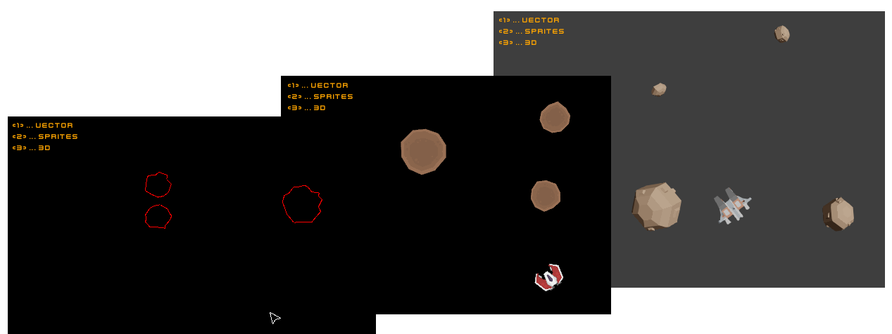

# asteroids

experiments with armory and ecx

- heavily based on eliasku's [ecx asteroids](https://github.com/eliasku/ecx-richardlord-asteroids) example (like 99% copy and paste)
- 2d via [Kha G2](https://github.com/kode/kha)
- 3d via [Iron / Armory](https://github.com/armory3d/armory)
- requires a [khamake patch](https://github.com/Kode/khamake/pull/158) to make the local armory sdk work

## assets

using free assets from [kenney.nl](https://www.kenney.nl)

- [space-shooter-extension](https://opengameart.org/content/space-shooter-extension-250)
- [space-kit](https://opengameart.org/content/space-kit)
- [ui-pack-space-extension](https://opengameart.org/content/ui-pack-space-extension)

##

